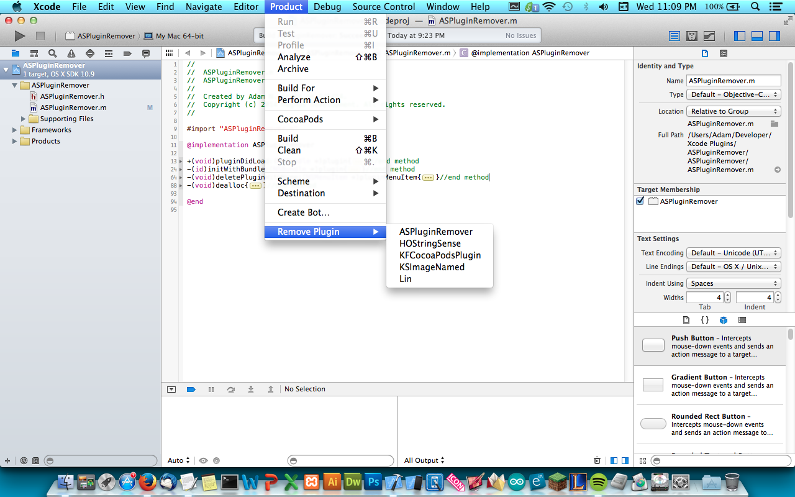
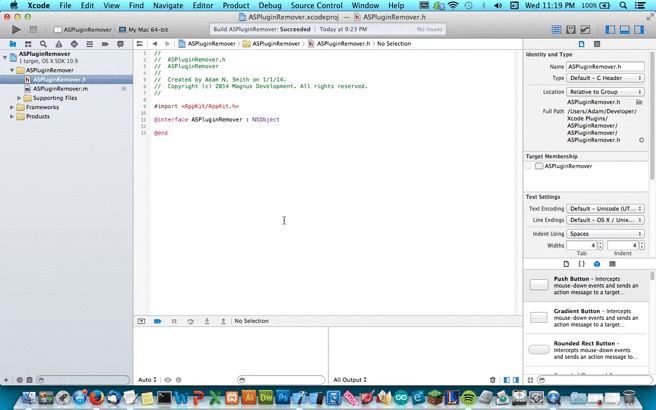

ASPluginRemover
=================

A Simple Xcode Plugin To Remove Xcode Plugins.
.

#Requirements
Requires Xcode5. Other versions of Xcode are not supported.

#Installation
Clone this repo or download the zip, open the xcodeproj file in Xcode and compile. After a restart of Xcode you will have a ‘Remove Plugin’ menu item in the 'Products' menu.

#How To Use
1) Navigate To: Products > Remove Plugin
2) Select the plugin to remove.
  

#Author
Adam Smith | MagnusDevelopment.com
